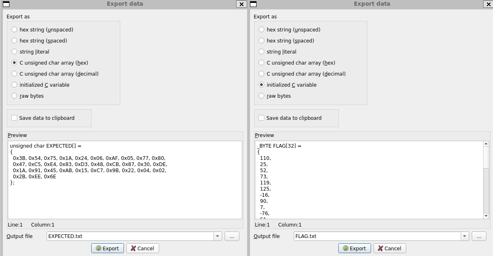
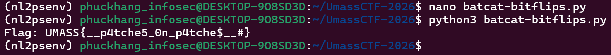

# [UMASS CTF 2026] WRITE UP BATCAVE-BITFLIPS - REVERSE ENGINEERING
By: **0x-mpkane6** - **Nguyễn Minh Phúc Khang** - **ATTN2024**<br>
*Trường Đại học Công nghệ thông tin (UIT) - ĐHQG TP.HCM*

## 1. Mô tả challenge
Challenge cung cấp 1 file zip `batcave-bitflips.zip`, sau khi giải nén thu được file **ELF 64-bit** `batcave_license_checker`. Đây là một chương trình yêu cầu nhập License Key để xác thực quyền truy cập vào "Batcave". Nếu nhập đúng, chương trình sẽ giải mã và in ra Flag.

## 2. Phân tích và khai thác
### Phân tích
Sử dụng IDA-Pro decompile hàm `main` của chương trình, có thể thấy workflow của chương trình như sau:
1. Chương trình yêu cầu người dùng nhập vào một chuỗi `s` (tối đa 32 ký tự).
2. Dữ liệu nhập vào được đưa qua hàm `hash(s, v6)`. Kết quả hash 32 bytes được lưu vào biến `v6`.
3. Sau đó, hàm `verify(v6)` sẽ kiểm tra xem hash này có khớp với một giá trị chuẩn hay không.
4. Nếu pass qua bước verify, chương trình gọi `decrypt_flag(v6)` để in ra flag cuối cùng.

Ban đầu, mình định sử dụng các công cụ thực thi ký hiệu như `Angr` để tự động tìm ra License Key. Tuy nhiên, khi phân tích sâu vào hàm `hash`, mình nhận thấy một trở ngại cực lớn:
```c
for ( i = 0; i <= 12513006; ++i ) {
    substitute(v4);
    mix(v4);
    rotate(v4);
}
```
Với **hơn 12 triệu** vòng lặp cho các phép toán `substitute` và `mix`, việc giả lập trạng thái bằng `Angr` sẽ gây ra tình trạng `state explosion` và ngốn sạch RAM trước khi tìm ra kết quả. Đây rõ ràng là một kỹ thuật `Anti-Symbolic` của tác giả.

Thay vì cố gắng bẻ khóa hàm `hash` để tìm **License Key**, mình chuyển hướng sang phân tích các hàm khác. Khi phân tích hàm `verify` mình phát hiện:
```c
return memcmp(a1, &EXPECTED, 0x20uLL) == 0;
```
Để chương trình chấp nhận, kết quả hash v6 bắt buộc phải trùng khớp với mảng byte `EXPECTED` đã có sẵn trong bộ nhớ.

Tiếp theo, tại hàm `decrypt_flag`:
```c
for ( i = 0; i <= 31; ++i ) {
    FLAG[i] |= *(_BYTE *)(i % 32 + a1);
}
```
Mảng `FLAG` (dữ liệu đã mã hóa) được kết hợp với kết quả hash (`a1` - lúc này chính là `EXPECTED`) để cho ra flag thực sự. Mặc dù decompile hiển thị là phép toán |=, nhưng dựa trên suy luận, đây thực chất là phép toán `XOR` bị nhận diện sai trong quá trình tối ưu hóa mã nguồn.

Dựa trên những dữ liệu quan trọng thu được từ 2 hàm trên, ta có thể tìm flag bằng cách trích xuất 2 mảng dữ liệu `FLAG` và `EXPECTED`, sau đó thực hiện phép `XOR`. 

### Tiến hành khai thác
Mình đã trích xuất hai mảng dữ liệu quan trọng từ binary:
- `EXPECTED:` Mảng 32 bytes mục tiêu.
- `FLAG (Encrypted):` Mảng byte chứa flag đã bị mã hóa.



Sau đó, mình viết một script `Python` để thực hiện phép toán XOR giữa hai mảng này:
```python
# Dữ liệu trích xuất từ binary
flag_enc = [110, 25, 52, 73, 119, 125, -16, 90, 7, -76, 51, -90, -116, -26, -26, 23, -5, -23, 111, -82, 46, -27, 38, -61, 112, -29, -60, 125, 39, 127, 43]
expected = [0x3B, 0x54, 0x75, 0x1A, 0x24, 0x06, 0xAF, 0x05, 0x77, 0x80, 0x47, 0xC5, 0xE4, 0x83, 0xD3, 0x48, 0xCB, 0x87, 0x30, 0xDE, 0x1A, 0x91, 0x45, 0xAB, 0x15, 0xC7, 0x9B, 0x22, 0x04, 0x02, 0x2B]

# Xử lý signed byte và giải mã
flag_bytes = [b & 0xFF for b in flag_enc]
flag = "".join(chr(flag_bytes[i] ^ expected[i]) for i in range(len(flag_bytes)))

print(f"Flag: {flag}") 
```



Sau khi chạy script Python trên, mình tìm được flag: `UMASS{__p4tche5_0n_p4tche$_#}`.