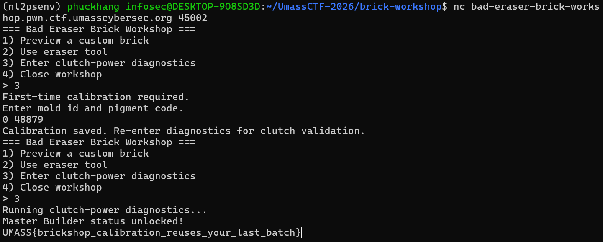

# [UMASS CTF 2026] WRITE UP BRICK-WORKSHOP - BINARY EXPLOITATION
By: **0x-mpkane6** - **Nguyễn Minh Phúc Khang** - **ATTN2024**<br>
*Trường Đại học Công nghệ thông tin (UIT) - ĐHQG TP.HCM*

## 1. Mô tả challenge
Challenge cung cấp một binary mô phỏng hệ thống `“Brick Workshop”`, cho phép người dùng tương tác qua menu với các chức năng như preview brick, erase notes và chạy hệ thống kiểm tra “clutch-power diagnostics”.

Mục tiêu là đạt được trạng thái `“Master Builder”`, từ đó hàm `win()` sẽ được gọi và in ra flag.

## 2. Phân tích và khai thác
### Phân tích challenge
Chương trình yêu cầu thực hiện một bước `“calibration”` trước khi có thể chạy diagnostics. Gợi ý trong đề bài nhấn mạnh vào:
- `“two-step calibration”`
- `“remembers old mold IDs and pigment codes”`

> Có thể tác giả đang ám chỉ việc chương trình lưu lại dữ liệu giữa các lần gọi.

```bash
(nl2psenv) phuckhang_infosec@DESKTOP-9O8SD3D:~/UmassCTF-2026/brick-workshop$ tree
.
├── Dockerfile
├── Makefile
├── bad_eraser
├── bad_eraser.c
└── bad_eraser.zip

1 directory, 5 files
```

Khi tiến hành giải nén, mình thu được các file:
- Dockerfile
- Makefile
- bad_eraser
- bad_eraser.c

Theo suy luận của mình, `bad_eraser.c` khả năng cao là file chứa mã nguồn của chương trình. Do đó, mình bắt đầu đọc file này đầu tiên để có thể hiểu cách mà chương trình hoạt động.

Quan sát tổng thể, chương trình là một menu loop đơn giản, cho phép người dùng chọn các chức năng khác nhau. Trong đó, đáng chú ý nhất là `option 3 – “clutch-power diagnostics”`, vì đây có khả năng là nơi kiểm tra điều kiện để in flag.

```c
static void banner(void) {
    puts("=== Bad Eraser Brick Workshop ===");
    puts("1) Preview a custom brick");
    puts("2) Use eraser tool");
    puts("3) Enter clutch-power diagnostics");
    puts("4) Close workshop");
    printf("> ");
}
```

Khi đọc vào hàm xử lý option này, mình nhận thấy một điểm khá quan trọng: chương trình yêu cầu thực hiện một bước `“calibration”` trước khi chạy `diagnostics` thực sự. Cụ thể, ở lần đầu chọn option 3, chương trình chỉ yêu cầu nhập `mold_id` và `pigment_code`, sau đó lưu lại và thoát ra menu, chứ chưa hề kiểm tra điều kiện win.

```c
...
    if (!service_initialized) {
        puts("First-time calibration required.");
        puts("Enter mold id and pigment code.");
        if (scanf("%u %u", &mold_id, &pigment_code) != 2) {
            exit(0);
        }

        puts("Calibration saved. Re-enter diagnostics for clutch validation.");
        service_initialized = 1;
        return;
    }
...
```

Ở lần gọi tiếp theo, chương trình không yêu cầu nhập lại dữ liệu, mà sử dụng chính các giá trị đã nhập trước đó để đưa vào hàm `diagnostics_bay()`. Điều này trùng khớp với gợi ý của đề bài về **“two-step calibration”** và việc hệ thống **“remember old mold IDs and pigment codes”**.

```c
static void diagnostics_bay(unsigned int mold_id, unsigned int pigment_code) {
    puts("Running clutch-power diagnostics...");
    if (clutch_score(mold_id, pigment_code) == 0x23ccdu) {
        win();
    }

    puts("Result: unstable clutch fit. Send batch back to sorting.");
    exit(0);
}
```

Từ đó, mình xác định được luồng khai thác đúng sẽ là:
- Lần 1: nhập dữ liệu calibration
- Lần 2: trigger kiểm tra để đạt điều kiện win

Tiếp theo, mình đi sâu vào điều kiện để gọi hàm `win()`. Trong `diagnostics_bay()`, chương trình kiểm tra:
```c
if (clutch_score(mold_id, pigment_code) == 0x23ccd)
```

Trong đó, hàm clutch_score() được định nghĩa như sau:
```c
static unsigned int clutch_score(unsigned int mold_id, unsigned int pigment_code) {
    return (((mold_id >> 2) & 0x43u) | pigment_code) + (pigment_code << 1);
}
```

Nếu mình đặt `a = ((mold_id >> 2) & 0x43)` và `p = pigment_code` thì khi đó biểu thức trả về sẽ trở thành: `(a | p) + 2p`.

Lúc này, mình nhận ra rằng nếu `a` chỉ chứa các bit đã có trong `p` (tức là (a | p) = p), thì biểu thức sẽ đơn giản thành: `p + 2p = 3p`.

Từ đó, giá trị p cần tìm là nghiệm của phương trình: `3p = 0x23CCD` <=> `p = 0xBEEF (48879)`.

Để thực hiện được giả thuyết trên, mình cần chọn giá trị `mold_id` sao cho `a = 0` <=> `((mold_id >> 2) & 0x43) = 0`. Ở đây, mình chọn `mold_id = 0`.

### Tiến hành khai thác
Từ phân tích trên, mình đã có 2 giá trị:
- `mold_id = 0`
- `pigment_code = 48879`

Tiến hành khai thác bằng cách kết nối nc tới port mà challenge cung cấp:
- Ở lần nhập đầu tiên, chọn option 3 và nhập lần lượt 2 giá trị 0 48879.
- Ở lần nhập tiếp theo, flag sẽ hiện ra khi chọn option 3.



Kết quả cho thấy suy luận trên của mình là đúng. Flag thu được: `UMASS{brickshop_calibration_reuses_your_last_batch}`. 