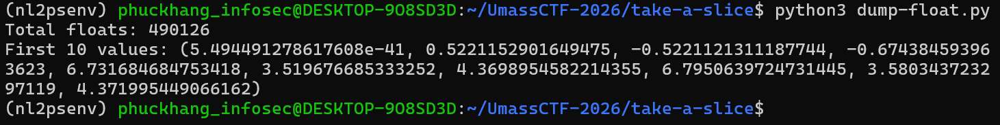
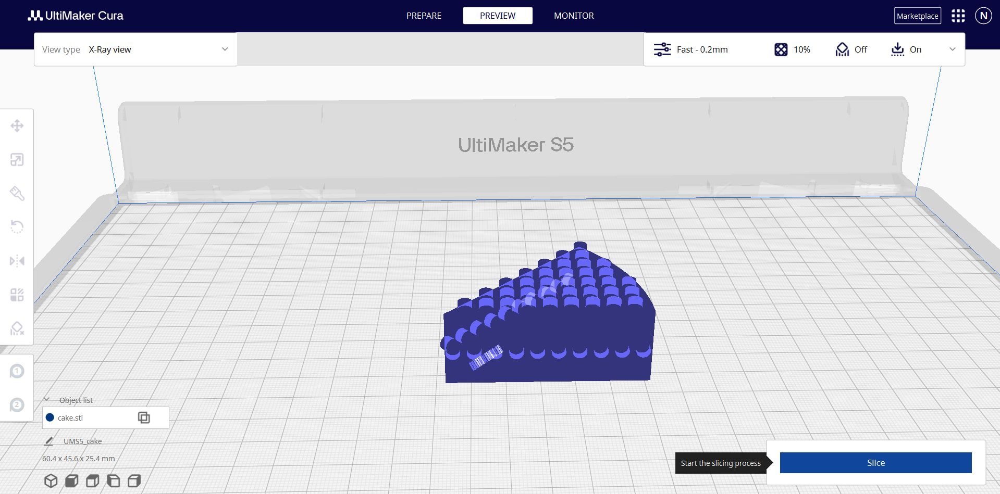

# [UMASS CTF 2026] WRITE UP TAKE-A-SLICE - MISCELLANEOUS
By: **0x-mpkane6** - **Nguyễn Minh Phúc Khang** - **ATTN2024**<br>
*Trường Đại học Công nghệ thông tin (UIT) - ĐHQG TP.HCM*

## 1. Mô tả challenge
Challenge `take-a-slice` cung cấp một file zip cùng tên. Khi giải nén, mình thu được file có tên `cake` - file không có phần đuôi mở rộng.  
## 2. Phân tích và khai thác
### Kiểm tra file cake
Do `cake` không có đuôi mở rộng và cũng không thể thực thi được, do đó mình tiến hành kiểm tra định dạng và nội dung file bằng các công cụ cơ bản để có thể phân tích sâu hơn.
```bash
(nl2psenv) phuckhang_infosec@DESKTOP-9O8SD3D:~/UmassCTF-2026/take-a-slice$ ./cake
-bash: ./cake: cannot execute binary file: Exec format error
```
#### Kiểm tra bằng file 
```bash
(nl2psenv) phuckhang_infosec@DESKTOP-9O8SD3D:~/UmassCTF-2026/take-a-slice$ file cake
cake: data
```
Kết quả trả về `data`, điều này cho thấy không thể xác định được file cụ thể.

#### Kiểm tra bằng xxd
```bash
(nl2psenv) phuckhang_infosec@DESKTOP-9O8SD3D:~/UmassCTF-2026/take-a-slice$ xxd cake | head
00000000: 0000 0000 0000 0000 0000 0000 0000 0000  ................
00000010: 0000 0000 0000 0000 0000 0000 0000 0000  ................
00000020: 0000 0000 0000 0000 0000 0000 0000 0000  ................
00000030: 0000 0000 0000 0000 0000 0000 0000 0000  ................
00000040: 0000 0000 0000 0000 0000 0000 0000 0000  ................
00000050: 2a99 0000 59a9 053f 24a9 05bf 78a4 2cbf  *...Y..?$...x.,.
00000060: f669 d740 6242 6140 2fd6 8b40 2a71 d940  .i.@bBa@/..@*q.@
00000070: 5a24 6540 63e7 8b40 bbb3 d940 3d3c 6440  Z$e@c..@...@=<d@
00000080: c774 8c40 0000 11a9 053f efa8 05bf d9a4  .t.@.....?......
00000090: 2cbf 3c49 d940 2cc4 5e40 4840 8e40 c748  ,.<I.@,.^@H@.@.H
```
Từ kết quả của ``xxd``, có thể thấy:
- Phần đầu file chứa nhiều byte `0x00` → có thể là **padding** hoặc **header** không quan trọng
- Sau offset `0x50`, dữ liệu bắt đầu có dạng lặp theo block 4 byte
- Xuất hiện nhiều byte có dạng `0x3f`, `0x40`, `0xbf`

Các giá trị này là đặc trưng của số thực theo chuẩn IEEE 754 (float):
- `0x3f` → số thực nhỏ (~0.x)
- `0x40` → số thực > 2
- `0xbf` → số âm

Từ đó có thể suy đoán:
>File cake chứa dữ liệu dạng mảng số thực (float), thay vì text hay format file thông thường.

#### Kiểm tra bằng strings
```bash
(nl2psenv) phuckhang_infosec@DESKTOP-9O8SD3D:~/UmassCTF-2026/take-a-slice$ strings cake | head
@bBa@/
@Z$e@c
@=<d@
^@H@
b@)Q
^@H@
@bBa@/
@R9b@FB
@Z$e@c
@R9b@FB
```
Kết quả từ `strings` không cho thấy bất kỳ chuỗi có ý nghĩa nào (không có flag hoặc text readable rõ ràng), các ký tự thu được mang tính ngẫu nhiên:
- Không phải ASCII text
- Không phải dữ liệu encode phổ biến (base64, hex, ...)

Điều này cho thấy:
>File không chứa dữ liệu dạng text mà có khả năng là dữ liệu nhị phân (binary data).

Kết hợp với phân tích từ `xxd`, có thể suy đoán dữ liệu được lưu dưới dạng số thực (float). 

#### Kiểm tra bằng cách dump ra float
Để củng cố cho lập luận trên, mình tiếp tục kiểm tra bằng cách dump dữ liệu của `cake` ra dạng số thực, và tiến hành quan sát 10 giá trị đầu tiên. Mục đích của bước kiểm tra này là để một lần nữa xác nhận định dạng nội dung file `cake` để có thể tiếp tục khai thác.

Sử dụng script Python:
```python
import struct

with open("cake", "rb") as f:
    data = f.read()

offset = 0x50
data = data[offset:]

ưn = len(data) // 4

floats = struct.unpack("<" + "f"*n, data[:n*4])

print("Total floats:", len(floats))
print("First 10 values:", floats[:10])
```


Từ kết quả trên, dễ dàng nhận thấy:
- Số lượng phần tử rất lớn (~490k giá trị)
- Các giá trị nằm trong khoảng nhỏ (~-1 → ~7), phù hợp với dữ liệu tọa độ hoặc không gian
- Không có dạng phân bố đặc trưng của:
    - ảnh (pixel thường 0–255 hoặc normalize 0–1)
    - audio (thường dao động -1 → 1 có dạng sóng)

Điều này cho thấy:
> Dữ liệu nhiều khả năng không phải media (ảnh/audio), mà là dữ liệu hình học (geometric data).

Vì dữ liệu được lưu dưới dạng các số thực và có kích thước lớn, khả năng cao file `cake` chứa các tọa độ (x, y, z) của một mô hình 3D.

### Trực quan hóa dữ liệu bằng Cura
Để trực quan hóa dữ liệu trong `cake` sang dạng 3D, mình sử dụng công cụ `Ultimaker Cura`.

Trước hết, mình tiến hành đổi tên file `cake` thành `cake.stl` để phù hợp với định dạng mô hình 3D, sau đó mình mới import vào `Cura.`



Kết quả thu được một mô hình có hình dạng chiếc bánh, đúng với tên file. Đáng chú ý, bên trong mô hình tồn tại một vùng được hiển thị khác biệt so với phần còn lại. 

Bằng cách xoay và quan sát mô hình từ nhiều góc độ xoay quanh thành phần đáng nghi đó, mình thu được flag ẩn bên trong chiếc bánh.


Flag thu được: `UMASS{SL1C3_&_D1C3}`.